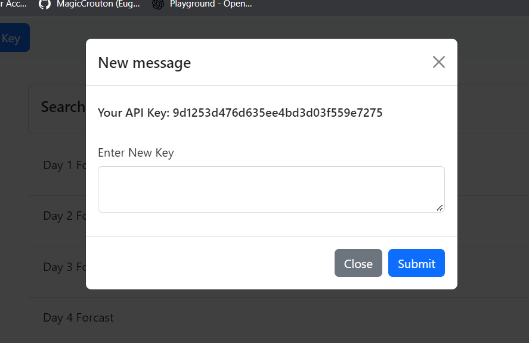

# Eugene Park GT Bootcamp Week 6 HW, weather app

## Description

In this app a user is able to search for any US city and pull down current weather data and a five day forcast via api connection to openweathermap.org. User can compare as many different cities as the user would like.

## Contributors

Eugene P

## Usage

A user first inputs a city into the search bar and pulls down weather data for that city, the weather data is stored in local memory in search history so the user can compare the weather data from multiple cites quickly. user may clear the memory data at any point.

the forcast data is presented in an accordian display, and the user can click each section for a more detailed weather forcast report.

The site will direct users to use an api key that has been generated from openweather API, users can also change the api key via the nav bar at any point. 

## Site Links
Live Site URL: https://magiccrouton.github.io/EugeneParkHW6-GTbootcamp/
Site Repo: https://github.com/MagicCrouton/EugeneParkHW6-GTbootcamp/

## Credits

city data was pulled from https://simplemaps.com/data/us-cities

## License

N/A
## Screenshots

Overview

Story Page

